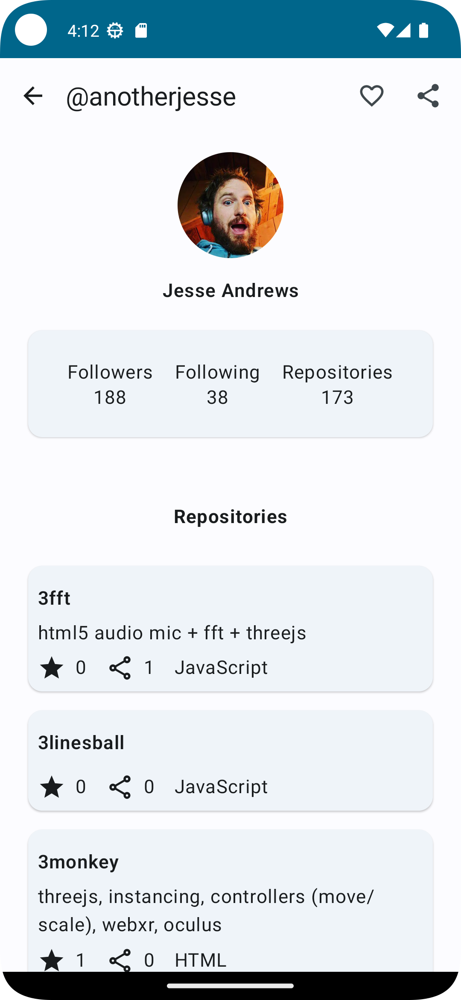
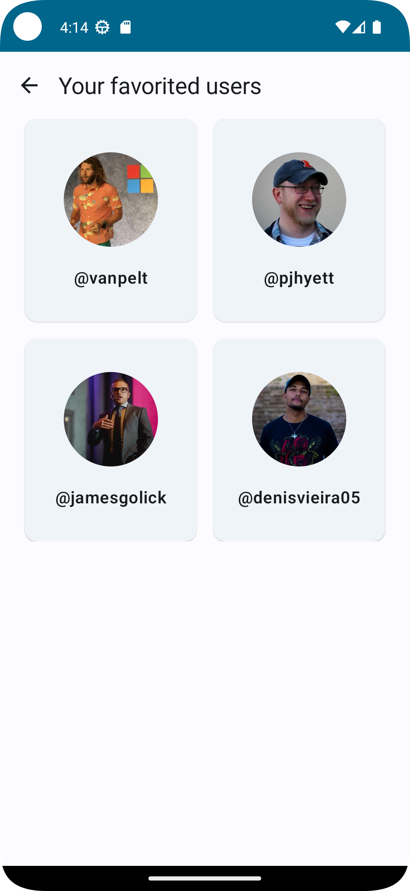
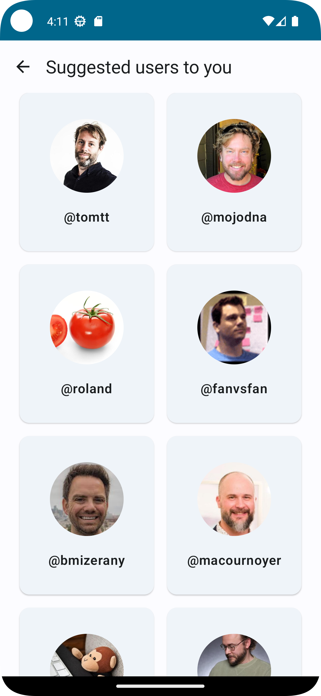

# Github User Search App

## Simple app that consuming [Github API](https://docs.github.com/en/rest?apiVersion=2022-11-28)

Simple app to find details, discover and favorite github users 

### Features
- See suggested users to visit
- Search for GitHub users by their username
- See relevant user information based on their search
- See a repositories list of users
- To favorite users and storage locally
- Show favorited users list
- See complete list of suggested users in another screen
- Unit and Integration tests
- Thread and exception management with coroutines flow

Coming soon
- Add detekt verifications
- Add github actions ci/cd setup
- Remove favorited user on favorited users list
- Cache config and improve state management
- Switch between light and dark themes
- Organize Fakes on Tests
- To Test DAO classes with room resources 
- To Test API classes mocking and mock fake server 
- UI tests

---

### Tech Stack Summary

- Compose, Dagger Hilt, Coroutines, Retrofit, Room, Mockk.

## Screens

|                           Home Screen                            |                           User Detail Screen                            |                           Favorited Users Screen                            |                           Suggested Users Screen                            |
|:----------------------------------------------------------------:|:-----------------------------------------------------------------------:|:---------------------------------------------------------------------------:|:---------------------------------------------------------------------------:|
|  |  |  |  |

© Denis Vieira Rufino